# User Guide

## 1. Project Overview

### 1.1 Application Details
EMS is a Java application built to assist HR in managing their employees' information. Pertinent details, including names, wages, work locations, and deduction rates, are stored and displayed by the application. The program is designed to be intuitive and adherent to Windows Design Guidelines. Features of the software include the ability to…

- See an overview of all the employees currently in the system
- Add and remove employees to and from the system
- Distinguish between part-time and full-time employees
- Edit an existing employee’s information, including changing them between part-time and full-time employment status
- Search for employees in the system, and calculate and display detailed income information (base wage/salary, net annual income, gross annual income)
- Save the current state of the system to an archive (`*.ems`) file
- Load states from existing archive (`*.ems`) files

### 1.2 Employee Information
Employees may be either part-time OR full-time. The following attributes are user-specified and are common to both employees:

- Employee number (positive integer)
- First name (string; may not contain `#`)
- Last name (string; may not contain `#`)
- Gender (integer values that correspond with pre-defined genders: Male, Female, and Other)
- Location (integer values that correspond with pre-defined cities: Mississauga, Ottawa, and Chicago)
- Deduction rate (decimal number between `0` and `1`, inclusive)

The following attributes are user-specified and unique to part-time employees:

- Hourly wage (positive number)
- Hours per week (positive number)
- Weeks per year (positive number)

The following attributes are user-specified and unique to full-time employees:

- Annual salary (positive number)

In addition to the user-specified attributes outlined above, the application also calculates the net annual income and gross annual income for each employee. These calculations are unique to each type of employee since they make use of their type-specific attributes.

## 2. User Interface Basics - Design & Philosophy
### 2.1 Core Functionality
The application consists of a single main window which displays an overview of the employees currently in the system. Entries are listed in table form (Fig. 2.1.1). However, whenever the database is empty, the table is replaced by a small user prompt (Fig. 2.1.2).

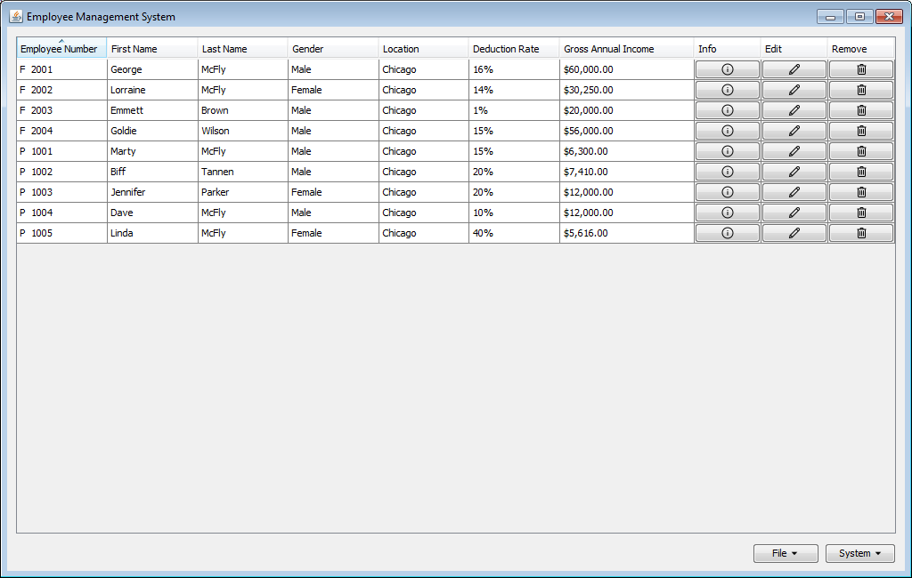

*Fig. 2.1.1. Main window displaying an overview of the employees in the system.*

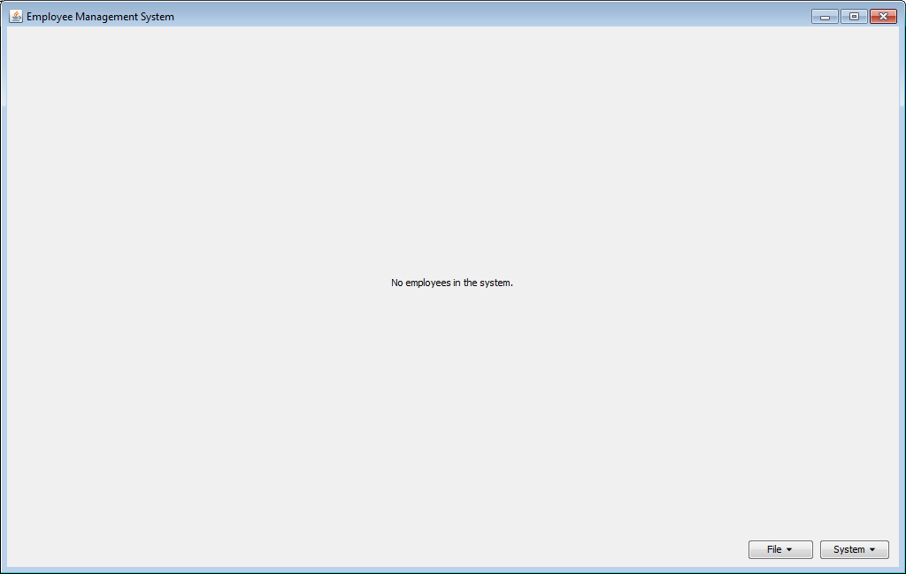

*Fig. 2.1.2. Main window displaying an empty database.*

There are 2 dropdown command buttons which serve as the primary point of interaction with the system. They group conceptually related actions together:

- **System**: manage/interact with the system directly
    - **Add**: Add a new employee to the system
    - **Remove**: remove an existing employee from the system
    - **Edit**: modify an existing employee’s information
    - **Search**: search for an employee and display detailed information about them
- **File**: mange archives of the system
    - **Open**: populate the system with an `*.ems` archive file
    - **Save as**: export the current state of the system into an `*.ems` archive file

These primary actions all invoke modal dialog forms which are secondary to the main window, which is persistent. Focus cannot be returned to the main window until the dialog has been dismissed, either by cancelling or approving the action.

### 2.2 Quick-Action Buttons
In the main table, each employee occupies one row with their major information. At the end of each row there are also 3 quick-action buttons, which allow the user to perform context-based actions, such as removing an employee by clicking on the appropriate button in their row, instead of manually searching for that employee. These action buttons are:

- **Info**: invokes the search dialog and automatically searches for that employee, displaying their detailed information
- **Edit**: invokes the edit dialog and automatically searches for that employee
- **Remove**: prompts for user confirmation, then automatically deletes the employee in that row from the system

### 2.3 System Table
Some final notes on the primary system table:

- The letters `P` or `F` are prepended to the employee number in the first column, to allow the user to quickly distinguish between part-time and full-time status
- For example, a part-time employee with employee number `1001` will be displayed as `P 1001` in the table
- The table is automatically refreshed whenever a modification is made to the system
- On load or refresh, the table is automatically sorted in ascending order by employee number
    - Full-time employees are displayed first, followed by part-time employees
    - To improve ease of use for large amounts of discontinuous data, the sorting is done alphabetically, as opposed to numerically (i.e. `123` will come before `99`); as employee numbers generally use the same number of digits this distinction will be unimportant in most cases
    - The user can sort the rows in the table by clicking on the header of the column they would like to sort by. Clicking again on the same header toggles between ascending and descending order
- If the system has been modified and the user has not yet saved it to file, the application will prompt for confirmation before quitting (Fig. 2.3.1)
    - If changes have been saved however, the program quits immediately when the user closes the window

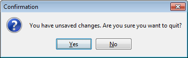

*Fig. 2.3.1. The user is asked to confirm before quitting if there are unsaved changes.*

## 3. System Actions
### 3.1 Add Employee
To add an employee to the system, select **System > Add**. This action invokes the Add Dialog (Fig. 3.1.1). The dialog consists of several empty text fields and unselected radio buttons. When empty, the text fields display grey text hints, informing the user of what information they should enter in that field. Note that the fields specific to part-time and full-time employees appear contextually based on the selection of the **Part-time** and **Full-time** radio buttons (Fig. 3.1.2).

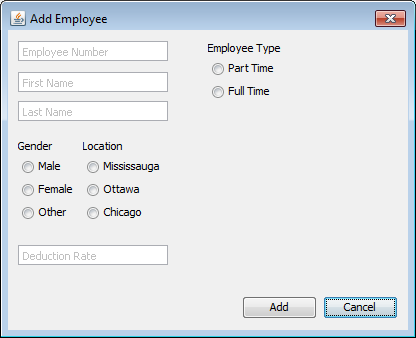

*Fig. 3.1.1. Instance of a new Add Dialog.*

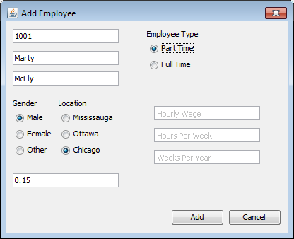

*Fig. 3.1.2. The type-specific fields appear contextually based on type selection.*

When valid inputs have been entered into all available fields, choosing **Add** will add the new employee to the system and refresh the main window. The following criteria determine whether the inputs are valid:

- No text fields are empty and no radio button groups are unselected
- The employee number is a positive integer
- The employee number does not belong to an employee already in the system
- The text fields for first/last name do not contain the `#` character
    - The hash is used as a delimiter in archive files, so it may not be used in text inputs
- The deduction rate is a decimal number between `0` and `1` (inclusive)
- For full-time employees, the salary is a positive number
- For part-time employees, the wage, hours per week, and weeks per year are all positive numbers

If any of these criteria have not been met, choosing **Add** will invoke a message dialog prompting the user to correct their inputs (Fig. 3.1.3).

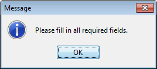

*Fig. 3.1.3. Example of a message indicating detection of an invalid input.*

### 3.2 Remove Employee
To remove an employee from the system, select **System > Remove**. This action invokes the Remove Dialog (Fig. 3.2.1). The user can then search for the employee number of the employee they wish to remove by entering the query and choosing **Search**, or pressing the Enter key. A contextual text hint below the search field prompts users to enter an employee number. If the number is not found, the text hint will display an error message and prompt the user to search again (Fig. 3.2.2). If the number is found, the **Remove** option is enabled, and the text hint will display the queried employee’s name and ask the user to confirm their removal from the system (Fig. 3.2.3). Choosing **Remove** will remove the queried employee and refresh the main window.

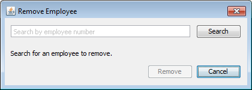

*Fig. 3.2.1. Instance of a new Remove Dialog.*

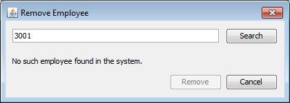

*Fig. 3.2.2. The text hint updates dynamically to guide the user.*

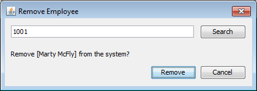

*Fig. 3.2.3. If an employee is found, confirmation is required to complete removal.*

### 3.3 Edit Employee Information
To edit an existing employee’s information, select **System > Edit**. This action invokes the Edit Dialog (Fig. 3.3.1). This form is essentially a hybrid of the Add Dialog and the Remove Dialog. The user can search for the employee whose information they wish to edit by entering the employee number into the search field. If an employee with that number is found in the system, the form will be populated with text fields like the Add Dialog, with each text field displaying its current value (Fig. 3.3.2). Once the user is finished making their changes, choosing **Done** will apply the changes to the system and refresh the main window if all inputs are valid.

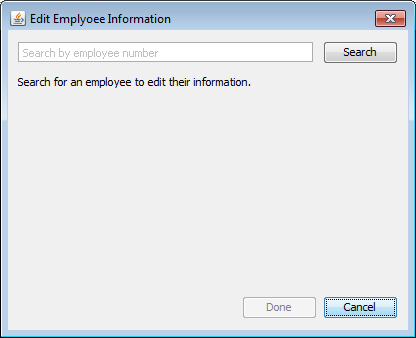

*Fig. 3.3.1. Instance of a new Edit Dialog.*

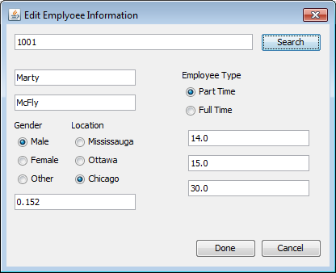

*Fig. 3.3.2. When an employee is found, the form is populated with their editable information.*

For the most part, the same input validation checks are done here as in the Add Dialog. If the employee number is found in the system, the following criteria determine whether the remaining inputs are valid:

- No text fields are empty and no radio button groups are unselected
- The text fields for first/last name do not contain the “#” character
    - The hash is used as a delimiter in archive files, so it may not be used in text inputs
- The deduction rate is a decimal number between 0 and 1 (inclusive)
- For full-time employees, the salary is a positive number
- For part-time employees, the wage, hours per week, and weeks per year are all positive numbers

If an error is detected, a message is shown to the user on **Done**, asking them to correct their inputs (Fig. 3.1.3). Note that once a user queries a certain employee number by choosing **Search**, that employee number will receive the changes unless a new number is entered into the search field and the user chooses **Search** a second time. Modifying the number in the search field after choosing **Search** therefore does nothing.

In addition, note that it is possible to change an existing employee from part-time to full-time status. However, it is not possible to change the employee number that they are associated with. Conceptually, the employee number is the “key value” for each employee, and therefore acts as a static anchor for the employee in the database. Therefore, to change the number associated with an employee, remove and re-add the employee.

### 3.4 Search for Employees
To view an employee’s detailed information, select **System > Search**. This action invokes the Search Dialog (Fig. 3.4.1).

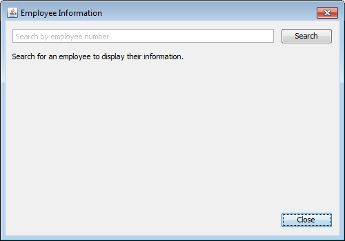

*Fig. 3.4.1. Instance of a new Search Dialog.*

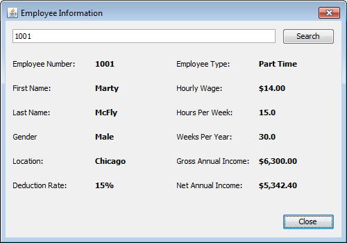

*Fig. 3.4.2. When an employee is found, the form is populated with their detailed information.*

The user is presented with a search field. As with the Remove and Edit Dialogs, a contextual text hint below the search field prompts users to enter an employee number. If the query is invalid or is not found, the text hint will display an error message and prompt the user to search again. If an employee with that number is found, the form will be populated with a static content panel containing their detailed information (Fig. 3.4.2). This includes both user-entered as well as calculated values, namely:

- Employee number
- First name
- Last name
- Gender, converted from integer value to actual gender name
- Location, converted from integer value to actual city name
- Deduction rate, rounded to the nearest percent
- Employee type (part-time or full-time)
    - **Part-time**: hourly wage, rounded to the nearest cent; hours per week and weeks per year; rounded to the nearest tenth
    - **Full-time**: annual salary, rounded to the nearest cent
- Net annual income, rounded to the nearest cent
- Gross annual income, rounded to the nearest cent

To leave this page and return to the main window, choose **Close**.

## 4. File Actions
### 4.1 Open File
To open an archive file and load its data into the application, select **File > Open**. This action invokes the File Chooser (Fig. 4.1.1). However, if the user has unsaved changes they will be prompted to confirm their intention as loading a new file will overwrite the current state of the system (Fig. 4.1.2). The user may browse their computer for a valid archive file. The program will only open files with the custom `*.ems` extension. For practical purposes, these archive files are simple text files as opposed to binary files, so they can be opened with a standard text editor application. However, it is strongly recommended that they are NOT modified manually, as doing so could make the archive unreadable to the application.

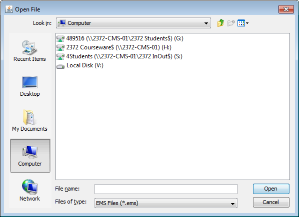

*Fig. 4.1.1. An instance of the Open File Chooser. The program only allows the selection of `*.ems` files.*

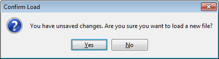

*Fig. 4.1.2. Loading a new file will overwrite anything currently in the system, so unsaved changes should first be saved.*

Once the user selects a file, the application will attempt to load it into the system. If the file has been damaged or incorrectly modified, the application will inform the user that the file is corrupted, and abort the load operation (Fig. 4.1.3).

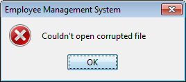

*Fig. 4.1.3. The program will not attempt to load corrupted files.*

### 4.2 Save File
To save the data in the application to an archive file, select **File > Save as**. This action invokes the File Chooser (Fig. 4.2.1). The user may browse their computer to select the location where they wish to save the file. They should also give the file a unique name. All files will be saved using the `*.ems` extension, and by default the file will be named `archive.ems`.

There are several situations where the save operation will fail, and the program will proactively handle these cases. For instance, it will display an error message if the user tries to save a file in a location which they do not have permission to write to.

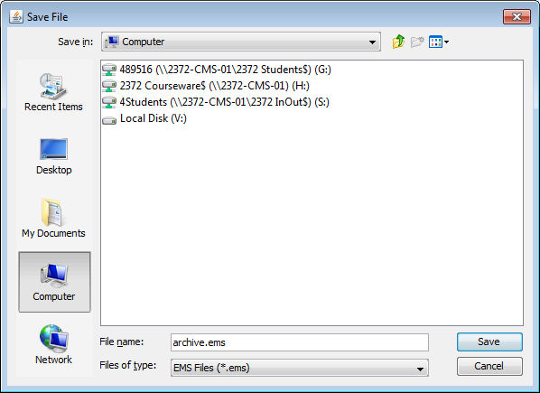

*Fig. 4.2.1. An instance of the Save File Chooser. The program will only create and write to `*.ems` files.*

Additionally, to protect user data, the application will not overwrite existing files. Therefore, it is not possible to save an archive to a location which already contains a file of the same name. Attempting to do this will also generate an error message, and the user will need to re-select **File > Save** as to continue generating the archive file (Fig. 4.2.2).

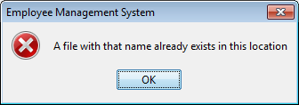

*Fig. 4.2.2. Files cannot have the same name and location as an existing one.*

### 4.3 More About `*.ems` Files
A `*.ems` archive file contains all the information stored in the database in a single plaintext file. It can be opened in any standard text editor application. Each line in the file stores the information for one employee. The attributes are separated with the `#` delimiter. The first value is a character flag – either `P` or `F` – to identify the employee as part-time or full-time, respectively. This is followed by the remaining attributes in the given order:

- Employee number
- First name
- Last name
- Gender (integer value only)
- Location (integer value only)
- Deduction rate (as a decimal)

And subsequently for part-time employees:

- Hourly wage
- Hours per week
- Weeks per year

Whereas for full-time employees:

- Annual salary

For example, the archive file for the table shown in Fig. 2.1.1 would consist of the following lines:

```
P#1001#Marty#McFly#0#2#0.152#14.0#15.0#30.0
F#2001#George#McFly#0#2#0.158#60000.0
P#1002#Biff#Tannen#0#2#0.2#9.5#15.0#52.0
F#2002#Lorraine#McFly#1#2#0.14#30250.0
F#2003#Emmett#Brown#0#2#0.01#20000.0
P#1003#Jennifer#Parker#1#2#0.2#12.0#25.0#40.0
F#2004#Goldie#Wilson#0#2#0.15#56000.0
P#1004#Dave#McFly#0#2#0.1#12.0#25.0#40.0
P#1005#Linda#McFly#1#2#0.4#9.0#12.0#52.0
```

Notice that the application writes employee data to the file in the order prescribed by the program’s internal data structure, and NOT in the order the table rows have been sorted. Table sorting is done independently from the data, before it is presented to the end user.